# AI Memory - Forge Codebase

## Quick Reference for AI Models

This document provides essential information for AI models working with the Forge codebase.

---

## Project Metadata

| Property | Value |
|----------|-------|
| **Project Name** | Forge |
| **Type** | C++ Project Manager CLI Tool |
| **Language** | C# (.NET 10) |
| **Build System** | CMake |
| **CLI Framework** | DotMake.CommandLine 2.0.0 |
| **Config Format** | TOML (via Tommy 3.1.2) |

---

## Directory Structure

```mermaid
graph TD
    Root["/root/forge/"]
    
    Root --> App["Application Files"]
    Root --> CMDS["Commands/"]
    Root --> Models["Models/"]
    Root --> Docs["docs/"]
    Root --> Config["Config Files"]
    
    App --> P[Program.cs]
    App --> PCM[ProjectConfigManager.cs]
    App --> PBM[ProjectBuildManager.cs]
    App --> UT[Utils.cs]
    App --> Proj[forge.csproj]
    
    CMDS --> RootCmd[RootCommand.cs]
    CMDS --> Create[CreateCommand.cs]
    CMDS --> Build[BuildCommand.cs]
    CMDS --> Run[RunCommand.cs]
    CMDS --> Test[TestCommand.cs]
    CMDS --> Clean[CleanCommand.cs]
    CMDS --> Embed[EmbedCommand.cs]
    CMDS --> New[NewCommand.cs]
    CMDS --> NewSub["New*/"]
    CMDS --> Project["ProjectCommand.cs"]
    CMDS --> ProjectSub["Project*/"]
    CMDS --> Lua["Lua/"]
    CMDS --> Conan["Conan/"]
    
    Models --> PC[ProjectConfig.cs]
    Models --> PS[ProjectSection.cs]
    Models --> Dep[Dependency.cs]
    Models --> RS[ResourcesSection.cs]
    
    Docs --> Arch[ARCHITECTURE.md]
    Docs --> Func[FUNCTIONALITY.md]
    Docs --> Mem[AI_MEMORY.md]
    Docs --> Read[README.md]
```



---

## Key Files and Their Purposes

### Entry Point

| File | Lines | Purpose |
|------|-------|---------|
| `Program.cs` | 10 | Initializes Lua engine, delegates to LuaBuilder |

### Core Services

| File | Lines | Purpose |
|------|-------|---------|
| `ProjectConfigManager.cs` | 184 | package.toml read/write using Tommy |
| `ProjectBuildManager.cs` | 9 | Static state for build-time dependencies |
| `Utils.cs` | 174 | Resource generation, test setup utilities |

### Models

| File | Lines | Purpose |
|------|-------|---------|
| `ProjectConfig.cs` | 11 | Main configuration container |
| `ProjectSection.cs` | 9 | [project] section model |
| `Dependency.cs` | 9 | Git dependency model |
| `ResourcesSection.cs` | 7 | Resource files model |

### Commands

| Command | File | Purpose |
|---------|------|---------|
| Root | `RootCommand.cs` | Base command (empty) |
| create | `CreateCommand.cs` | New project scaffolding |
| build | `BuildCommand.cs` | CMake generation + build |
| run | `RunCommand.cs` | Execute project/scripts |
| test | `TestCommand.cs` | Run Google Test |
| clean | `CleanCommand.cs` | Remove build directory |
| embed | `EmbedCommand.cs` | Register resource files |
| new class | `NewClassCommand.cs` | Generate class boilerplate |
| new struct | `NewStructCommand.cs` | Generate struct boilerplate |
| new header | `NewHeaderCommand.cs` | Generate header file |
| new source | `NewSourceCommand.cs` | Generate header+source pair |
| project info | `InfoCommand.cs` | Display project info |
| project tree | `TreeCommand.cs` | Display file tree |
| project stats | `StatsCommand.cs` | Display statistics |
| project deps | `DependenciesCommand.cs` | List dependencies |
| project scripts | `ScriptsCommand.cs` | List scripts |
| install | `Commands/Conan/InstallCommand.cs` | Conan integration |

### Lua Engine

| File | Lines | Purpose |
|------|-------|---------|
| `LuaEngine.cs` | 255 | Lua sandbox setup with environment functions |
| `LuaBuilder.cs` | 21 | Executes Lua build scripts |
| `LuaDefinitionGenerator.cs` | N/A | Generates environment definitions |

---

## Command Pattern

All CLI commands follow this pattern:

```csharp
[CliCommand(
    Name = "command-name",
    Description = "What it does",
    Parent = typeof(ParentCommand)
)]
public class CommandName
{
    // Positional arguments
    [CliArgument(Description = "...")]
    public string Argument { get; set; } = default!;
    
    // Optional flags
    [CliOption(Description = "...")]
    public bool Flag { get; set; }
    
    // Returns exit code (0 = success)
    public int Run()
    {
        // Implementation
        return 0;
    }
}
```

---

## Configuration Loading Pattern

```csharp
// Load configuration
var config = ProjectConfigManager.LoadConfig();

// Access properties
config.Project.Name              // string
config.Project.Type              // "executable" | "library"
config.Dependencies              // Dictionary<string, Dependency>
config.ConanDependencies        // Dictionary<string, string>
config.Resources.Files          // List<string>
config.Scripts                   // Dictionary<string, string>
```

---

## Dependencies Package Reference

| Package | Version | Purpose |
|---------|---------|---------|
| DotMake.CommandLine | 2.0.0 | CLI framework |
| Tommy | 3.1.2 | TOML parsing |
| Spectre.Console | 0.50.0 | Terminal UI |
| LuaCSharp | 0.5.0 | Lua scripting |

---

## Lua API Quick Reference

```lua
-- Environment
forge.current_working_dir

-- OS
forge.os.current        -- "linux", "macos", "windows"
forge.os.windows
forge.os.macos
forge.os.linux

-- Distro (Linux)
forge.distro.my_distro  -- Auto-detected
forge.distro.ubuntu
forge.distro.arch
-- ... etc

-- Package managers
forge.package_manager.brew
forge.package_manager.aptget
forge.package_manager.pacman

-- Functions
forge.pull_repo(url)
forge.get_packages(password, manager, packages)
forge.log.info(message)
```

---

## CMake Generation Locations

**BuildCommand.cs:60-183** generates the CMake content:
- Lines 60-67: C++ standard
- Lines 70-101: FetchContent dependencies
- Lines 103-111: Conan find_package
- Lines 113-130: Project target (executable/library)
- Lines 133-138: target_link_libraries
- Lines 140-169: Test configuration
- Lines 171-183: File writing

---

## Common Modification Points

### 1. Add New Command

```csharp
// Commands/NewCommand.cs
[CliCommand(Name = "new", Parent = typeof(RootCommand))]
public class NewCommand { }

// Commands/NewSubCommand.cs
[CliCommand(Name = "sub", Parent = typeof(NewCommand))]
public class NewSubCommand
{
    public int Run() { /* ... */ }
}
```

### 2. Add Config Option

1. Add to `Models/ProjectConfig.cs`
2. Update `ProjectConfigManager.LoadConfig()` parsing
3. Update `ProjectConfigManager.SaveConfig()` serialization

### 4. Add Lua Function

```csharp
// In LuaEngine.cs, add to SetDefinitionTables():
var myFunc = new LuaFunction("my_func", (context, token) =>
{
    var arg = context.GetArgument<string>(0);
    // Implementation
    return ValueTask.FromResult(0);
});
_cpm[new LuaValue("my_func")] = new LuaValue(myFunc);
```

---

## Build and Test Commands

```bash
# Build
dotnet build -c Release

# Run locally
dotnet run --project . -- [command]

# Publish (current platform)
dotnet publish -c Release

# AOT publish (specific platform)
dotnet publish -c Release -r linux-x64 --self-contained
```

---

## External Tools Called

| Tool | Purpose | Called From |
|------|---------|-------------|
| `cmake` | Build system | BuildCommand |
| `conan` | Package manager | InstallCommand |
| `git` | Clone repositories | LuaEngine |
| `bash` | Run scripts | RunCommand |

---

## Important Implementation Details

1. **Project root detection**: Walks up directory tree looking for `package.toml`
2. **Static state**: ProjectBuildManager persists across command invocations
3. **Lua scripts**: Located in `.config/forge/build/*.lua`, executed at startup
4. **CMake generation**: Two files - root CMakeLists.txt (minimal) + `.config/cmake/CMakeLists.txt` (generated)
5. **Resource embedding**: Generates `embedded_resources.h` and `embedded_resources.cpp`

---

## Error Message Patterns

| Scenario | Message Format |
|----------|---------------|
| No package.toml | `Error: Not a forge project. package.toml not found.` |
| CMake not found | `Error: cmake command not found. Please ensure CMake is installed.` |
| Script not found | `Error: Script 'name' not found in package.toml.` |
| Invalid dependency | `Warning: Skipping invalid dependency 'name'. 'git' and 'tag' are required.` |

---

## Version Information

- **.NET**: 10.0
- **Target Framework**: net10.0
- **Publish**: AOT (Ahead-of-Time)
- **Runtimes**: win-x64, linux-x64, osx-x64

---

## File Naming Conventions

- **Commands**: `PascalCase` + `Command.cs` suffix
- **Models**: PascalCase + `.cs` suffix (no suffix for main model)
- **Utilities**: `PascalCase` (e.g., `Utils.cs`, `ProjectConfigManager.cs`)

---

## Key Constants

| Constant | Value | Location |
|----------|-------|----------|
| Config filename | `package.toml` | ProjectConfigManager.cs:9 |
| Lua build dir | `.config/forge/build/` | LuaBuilder.cs:8 |
| CMake output | `.config/cmake/CMakeLists.txt` | BuildCommand.cs:171 |
| Default C++ std | `20` | BuildCommand.cs:16 |
| Min CMake version | `3.23` | BuildCommand.cs:176 |
