# Forge Architecture Documentation

## Table of Contents

1. [Overview](#overview)
2. [System Architecture](#system-architecture)
3. [Core Components](#core-components)
4. [Build Pipeline](#build-pipeline)
5. [Data Flow](#data-flow)
6. [Extension Points](#extension-points)
7. [Dependency Analysis](#dependency-analysis)
8. [Platform Support](#platform-support)

---

## Overview

Forge is a C++ project manager built with C# (.NET 10) that provides a streamlined CLI for managing C++ projects using CMake. It was created to simplify common C++ development workflows including project scaffolding, dependency management, resource embedding, and build automation.

The architecture follows a **layered modular design pattern** with clear separation of concerns:

- **CLI Layer**: Command parsing and execution via DotMake.CommandLine
- **Service Layer**: Core business logic for configuration, building, and utilities
- **Model Layer**: Data structures representing project configuration
- **External Integration Layer**: Interfaces with CMake, Conan, Git, and Lua

This architecture enables easy extension through Lua scripting while maintaining a clean, testable codebase.

---

## System Architecture

### High-Level Component Diagram

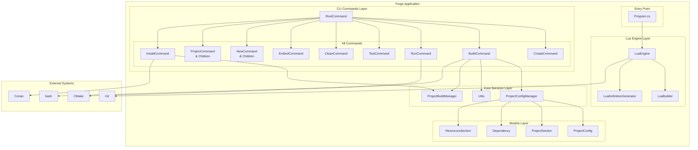

### Command Hierarchy

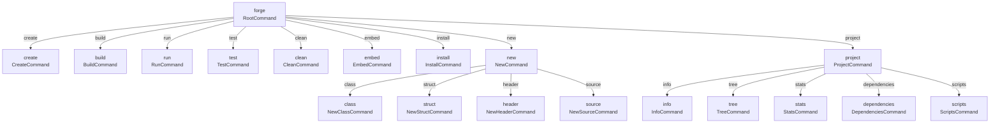

---

## Core Components

### 1. Entry Point (Program.cs)

The entry point is remarkably minimal due to the delegation of logic to commands and services.

**Location**: `/root/forge/Program.cs`

**Responsibilities**:
1. Initialize the Lua sandbox engine before any commands run
2. Delegate command execution to the Lua builder for custom scripts
3. Provide a clean bootstrap that allows lazy-loading of command logic

**Code Structure**:

```csharp
// Entry point delegates to Lua builder
using DotMake.CommandLine;
using forge.Commands;
using forge.Commands.Lua;

// Initialize Lua sandbox before command execution
LuaEngine.InitialiseLuaEngine();

// Execute build scripts from .config/forge/build/
await LuaBuilder.RunBuilderScripts();
```

**Design Rationale**: The minimal entry point reflects Forge's philosophy of making the build process extensible through Lua. Rather than hardcoding command handlers, the system loads and executes Lua scripts that can modify the build behavior.

---

### 2. CLI Commands Layer

The CLI layer uses **DotMake.CommandLine**, a convention-based framework that eliminates boilerplate by inferring command structure from attributes and class naming.

#### Command Base Pattern

All commands inherit from a common pattern:

```csharp
[CliCommand(
    Name = "command-name",           // CLI name: forge command-name
    Description = "What it does",   // Help text
    Parent = typeof(ParentCommand)   // Subcommand hierarchy
)]
public class CommandName
{
    // Positional arguments (required)
    [CliArgument(Description = "What it is")]
    public string ArgumentName { get; set; } = default!;
    
    // Optional flags
    [CliOption(Description = "Optional flag")]
    public bool FlagOption { get; set; }
    
    [CliOption(Description = "Optional value")]
    public string ValueOption { get; set; } = "default";
    
    // Main execution - returns exit code
    public int Run()
    {
        // Implementation
        return 0; // Success
    }
}
```

#### Command Categories

| Category | Commands | Purpose |
|----------|----------|---------|
| **Project Lifecycle** | create, build, run, test, clean | Core development workflow |
| **Code Generation** | new class/struct/header/source | Scaffolding boilerplate |
| **Resources** | embed | Asset management |
| **Information** | project info/tree/stats/dependencies/scripts | Project introspection |
| **Package Management** | install (Conan) | Dependency resolution |

#### CreateCommand (`Commands/CreateCommand.cs`)

Creates a new C++ project with standard directory structure.

**Key Operations**:
1. Validates project name
2. Creates directory hierarchy:
   - `src/` - Source code
   - `external/` - External dependencies
   - `assets/` - Resource files
   - `.config/forge/` - Forge configuration
3. Generates initial `package.toml`
4. Creates Lua environment definitions
5. Sets up .gitignore

**Implementation Details**:

```csharp
public void Run()
{
    var projectName = Name;
    
    // Create base directories
    Directory.CreateDirectory(projectName);
    Directory.CreateDirectory(Path.Combine(projectName, "src"));
    Directory.CreateDirectory(Path.Combine(projectName, "external"));
    Directory.CreateDirectory(Path.Combine(projectName, "assets"));
    Directory.CreateDirectory(Path.Combine(projectName, ".config"));
    
    // Create Lua-specific directories
    Directory.CreateDirectory(Path.Combine(projectName, ".config", "forge", "commands"));
    Directory.CreateDirectory(Path.Combine(projectName, ".config", "forge", "build"));
    Directory.CreateDirectory(Path.Combine(projectName, ".config", "forge", "templates"));
    Directory.CreateDirectory(Path.Combine(projectName, ".config", "forge", "definitions"));
    
    // Initialize Lua definitions
    LuaEngine.SetEnvironmentDefinitions(projectName);
    
    // Generate initial package.toml
    var projectConfig = new ProjectConfig
    {
        Project = new ProjectSection
        {
            Name = projectName,
            Type = Type
        }
    };
    ProjectConfigManager.SaveConfig(projectConfig, projectName);
}
```

#### BuildCommand (`Commands/BuildCommand.cs`)

The most complex command - handles the entire CMake build process.

**Process Flow**:
1. Load and validate project configuration
2. Execute pre-build script (if defined)
3. Install Conan dependencies
4. Generate resource files (if any)
5. Generate CMakeLists.txt files
6. Run CMake configure
7. Run CMake build
8. Create compile_commands.json symlink
9. Execute post-build script (if defined)

**CMake Generation Logic** (lines 60-183):

```csharp
// C++ Standard configuration
cmakeContent.AppendLine($"set(CMAKE_CXX_STANDARD {Standard})");
cmakeContent.AppendLine("set(CMAKE_CXX_STANDARD_REQUIRED ON)");
cmakeContent.AppendLine("set(CMAKE_CXX_EXTENSIONS OFF)");

// FetchContent dependencies
foreach (var dep in projectConfig.Dependencies)
{
    cmakeContent.AppendLine($"FetchContent_Declare({name} GIT_REPOSITORY \"{details.Git}\" GIT_TAG \"{details.Tag}\")");
    cmakeContent.AppendLine($"FetchContent_MakeAvailable({dep.Key})");
}

// Project target (executable or library)
if (projectConfig.Project.Type == "executable")
{
    cmakeContent.AppendLine($"add_executable({projectName} ${{SOURCES}})");
}
else if (projectConfig.Project.Type == "library")
{
    cmakeContent.AppendLine($"add_library({projectName} STATIC ${{SOURCES}})");
}

// Test configuration (if test/ directory exists)
if (Directory.Exists("test"))
{
    cmakeContent.AppendLine("enable_testing()");
    cmakeContent.AppendLine($"add_executable(run_tests ${{TEST_SOURCES}} ${{SOURCES_FOR_TESTS}})");
    cmakeContent.AppendLine("include(GoogleTest)");
    cmakeContent.AppendLine("gtest_discover_tests(run_tests)");
}
```

---

### 3. Core Services

#### ProjectConfigManager (`ProjectConfigManager.cs`)

The central configuration management service that handles all read/write operations for `package.toml`.

**Key Design Patterns**:

1. **File Discovery**: Uses directory traversal to find project root
2. **TOML Parsing**: Leverages Tommy library for TOML 1.0 compliance
3. **Lazy Loading**: Config is loaded on-demand, not at startup

**Core Methods**:

| Method | Signature | Description |
|--------|-----------|-------------|
| `LoadConfig` | `ProjectConfig? LoadConfig()` | Parses package.toml, returns null if not found |
| `SaveConfig` | `void SaveConfig(ProjectConfig, string?)` | Serializes config to TOML |
| `FindProjectRoot` | `string? FindProjectRoot()` | Walks up directory tree to find project |
| `GetProjectName` | `string? GetProjectName()` | Convenience method for quick name lookup |

**Configuration Loading Flow**:

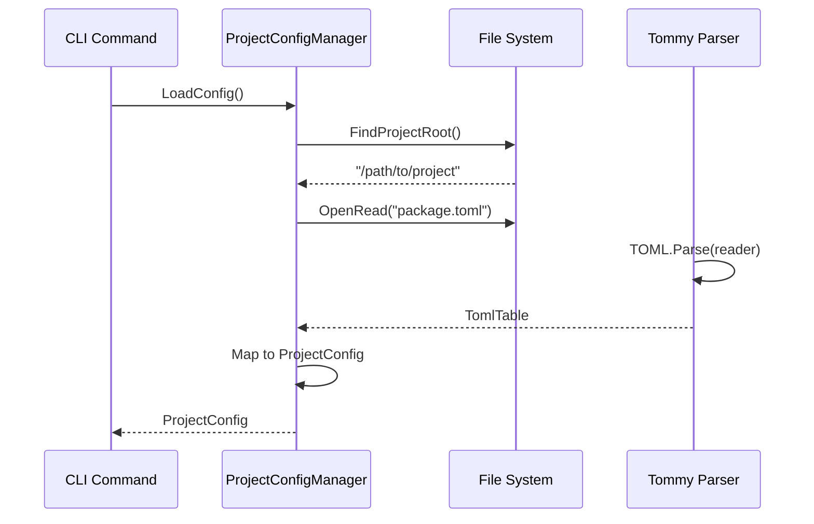

**Configuration Structure**:

```toml
[project]
name = "my_project"       # Project identifier
type = "executable"        # executable | library
install_headers = false   # For libraries: install headers

[dependencies]
# Git-based (FetchContent)
sdl = { git = "...", tag = "2.30.3", target = "SDL2::SDL2" }
fmt = { git = "...", tag = "10.2.1" }

[conan-dependencies]
# Conan packages
fmt = "10.2.1"
spdlog = "1.12.0"

[resources]
files = ["assets/icon.png", "assets/shader.glsl"]

[scripts]
pre-build = "echo 'Building'"
post-build = "echo 'Done'"
```

#### ProjectBuildManager (`ProjectBuildManager.cs`)

A stateful service that maintains build-time information across command invocations.

**Purpose**: Bridges the gap between the Conan install phase (InstallCommand) and the build phase (BuildCommand).

**Managed State**:

```csharp
public static class ProjectBuildManager
{
    // CMake target_link_libraries() targets from Conan
    public static List<string> LinkDependencies = new();
    
    // find_package() modules from Conan
    public static List<string> FindDependencies = new();
}
```

**Why Static State?**: The Conan install command runs as a separate step before build. By storing the parsed CMake targets in static lists, the build command can access them without re-parsing the Conan output.

**Flow**:

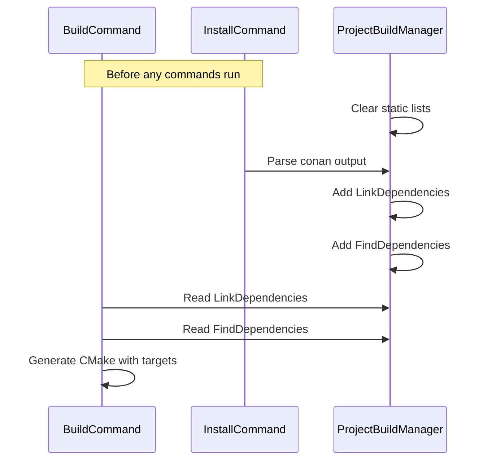

#### Utils (`Utils.cs`)

Provides miscellaneous utility functions used across commands.

**Key Functions**:

| Function | Purpose |
|----------|---------|
| `GenerateResourceFiles()` | Converts binary files to C++ byte arrays |
| `CreateTests()` | Sets up Google Test framework |
| `SanitizeFileName()` | Converts filenames to valid C++ identifiers |

**Resource Generation Details**:

The resource embedding system converts any binary file to compile-time embedded data:

1. Reads file as byte array
2. Generates unique C++ identifier from filename
3. Creates byte array definition
4. Generates lookup map for runtime access

```cpp
// Generated embedded_resources.h
namespace Embedded {
    struct Resource {
        const unsigned char* data;
        size_t size;
    };
    const Resource& get(const std::string& name);
}

// Generated embedded_resources.cpp
const unsigned char assets_icon_png_data[] = {
    0x89, 0x50, 0x4E, 0x47, ...
};
const size_t assets_icon_png_size = 1234;

namespace Embedded {
    static const std::map<std::string, Resource> resource_map = {
        {"icon.png", {assets_icon_png_data, assets_icon_png_size}}
    };
    
    const Resource& get(const std::string& name) {
        return resource_map.at(name);
    }
}
```

---

### 4. Lua Engine

The Lua engine provides a **scriptable build system** that allows users to customize and extend Forge's behavior without modifying the C# codebase.

#### LuaEngine (`Commands/Lua/LuaEngine.cs`)

Initializes and configures the Lua state with sandboxed functions.

**Initialization Sequence**:

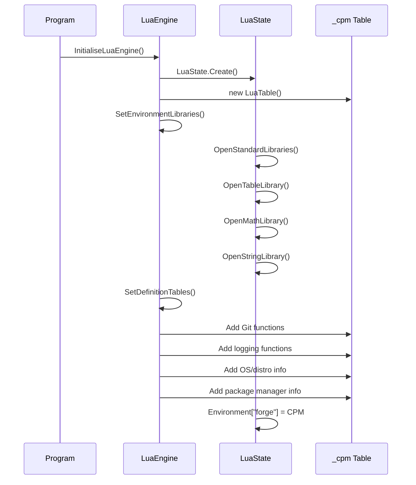

**Available Lua API**:

```lua
-- ==========================================
-- Operating System Detection
-- ==========================================
forge.os.current        -- "linux", "macos", "windows"
forge.os.windows       -- true if Windows
forge.os.macos         -- true if macOS  
forge.os.linux         -- true if Linux

-- ==========================================
-- Linux Distribution Detection
-- ==========================================
forge.distro.ubuntu
forge.distro.debian
forge.distro.arch
forge.distro.manjaro
forge.distro.fedora
forge.distro.nixos
forge.distro.my_distro  -- Auto-detected current distro

-- ==========================================
-- Package Manager Constants
-- ==========================================
forge.package_manager.brew      -- "brew"
forge.package_manager.aptget    -- "apt-get"
forge.package_manager.pacman    -- "pacman"
forge.package_manager.winget   -- "winget"
forge.package_manager.chocolatey -- "choco"
forge.package_manager.no_pass  -- "nopass" (no sudo needed)

-- ==========================================
-- Functions
-- ==========================================

-- Clone a git repository to external/
forge.pull_repo(url)
-- Example: forge.pull_repo("https://github.com/libsdl-org/SDL.git")

-- Install system packages via package manager
forge.get_packages(password, manager, packages)
-- password: "nopass" or actual password
-- manager: forge.package_manager.brew, etc.
-- packages: {"package1", "package2"}

-- Logging
forge.log.info(message)
-- Example: forge.log.info("Building complete!")

-- ==========================================
-- Environment
-- ==========================================
forge.current_working_dir  -- Current directory path
```

#### Lua Function Implementations

**pull_repo Function**:

```csharp
var pullRepoFunc = new LuaFunction("pull_repo", async (context, token) =>
{
    var repoUrl = context.GetArgument<string>(0);
    var repoName = repoUrl.Split('/')[^1].Split(".")[0];
    
    var processStartInfo = new ProcessStartInfo(
        "git", 
        $"clone {repoUrl} external/{repoName}"
    )
    {
        UseShellExecute = false,
        RedirectStandardOutput = true,
        RedirectStandardError = true,
        CreateNoWindow = true,
    };
    
    using var process = Process.Start(processStartInfo);
    await process.WaitForExitAsync(token);
    return process.ExitCode;
});
```

**get_packages Function**:

Handles cross-platform package installation:

```csharp
var getPackagesFunc = new LuaFunction("get_packages", async (context, token) =>
{
    var password = context.GetArgument<string>(0);
    var packageManager = context.GetArgument<string>(1);
    var packages = context.GetArgument<LuaTable>(2);
    
    var command = packageManager switch {
        "brew" or "winget" or "apt-get" or "choco" => " install ",
        "pacman" => " -S ",
        _ => " "
    } + string.Join(" ", packages);
    
    // Handle sudo for different package managers
    var needsSudo = packageManager switch {
        "brew" or "apt-get" or "pacman" => true,
        _ => false
    };
    
    if (needsSudo && password != "nopass")
    {
        // Run with sudo -S flag
    }
    else
    {
        // Run without sudo
    }
});
```

#### LuaBuilder (`Commands/Lua/LuaBuilder.cs`)

Executes Lua scripts from the build scripts directory.

**Location**: `.config/forge/build/*.lua`

**Execution Flow**:

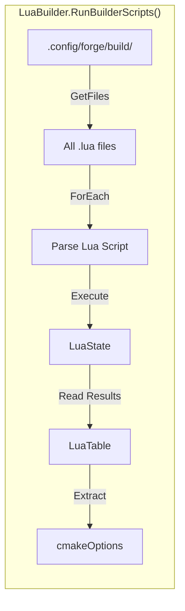

**Usage Example**:

```lua
-- .config/forge/build/custom_build.lua
forge.log.info("Starting custom build configuration")

-- Add custom CMake options
cmakeOptions = {
    extra_defines = {"MY_CUSTOM_FLAG"},
    extra_includes = {"/path/to/include"}
}

-- Clone required dependencies
forge.pull_repo("https://github.com/example/library.git")
```

#### LuaDefinitionGenerator (`Commands/Lua/LuaDefinitionGenerator.cs`)

Generates environment definition files for new projects.

**Purpose**: Creates `.config/forge/definitions/defintions.lua` with platform-specific information for the current environment.

---

### 5. Models Layer

Pure C# classes representing configuration data with no business logic.

#### Class Diagram

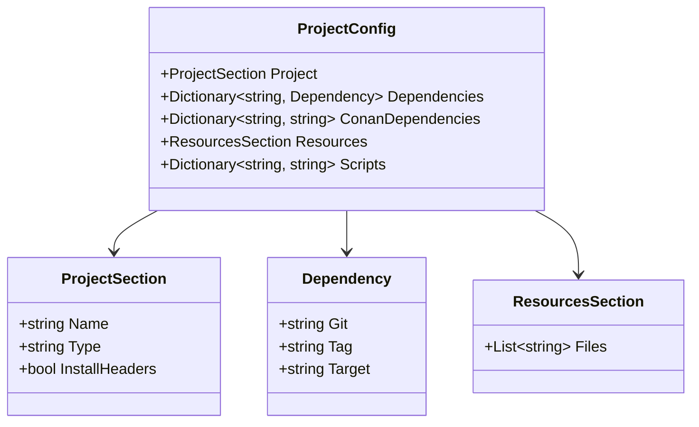

---

## Build Pipeline

### Detailed Build Flow

```mermaid
flowchart TB
    subgraph PreBuild["Pre-Build Phase"]
        Start[User: forge build] --> Load[Load package.toml]
        Load --> Check{Scripts defined?}
        Check -->|Yes| PreScript[Run pre-build script]
        Check -->|No| Conan[Install Conan deps]
        PreScript --> Conan
    end
    
    subgraph ConanInstall["Conan Installation"]
        Conan --> GenConan[Generate conanfile.txt]
        GenConan --> RunConan[conan install]
        RunConan --> Parse[Parse CMake output]
        Parse --> Store[Store in ProjectBuildManager]
    end
    
    subgraph ResourceGen["Resource Generation"]
        Store --> HasResources{Resources defined?}
        HasResources -->|Yes| ReadFiles[Read binary files]
        ReadFiles --> GenHeaders[Generate .h/.cpp]
        HasResources -->|No| CMakeGen
    end
    
    subgraph CMakeGen["CMake Generation"]
        GenHeaders --> SetStd[Set C++ standard]
        SetStd --> FetchDeps[Configure FetchContent]
        FetchDeps --> AddTarget[Add project target]
        AddTarget --> LinkDeps[Link dependencies]
        LinkDeps --> Tests{Test dir exists?}
        Tests -->|Yes| TestConfig[Configure Google Test]
        Tests -->|No| WriteCMake[Write CMakeLists.txt]
        TestConfig --> WriteCMake
    end
    
    subgraph BuildExecution["Build Execution"]
        WriteCMake --> Configure[CMake configure]
        Configure --> Build[CMake build]
        Build --> Symlink[Create compile_commands.json]
    end
    
    subgraph PostBuild["Post-Build Phase"]
        Symlink --> PostScript{post-build defined?}
        PostScript -->|Yes| RunPost[Run post-build script]
        PostScript -->|No| Success[Build complete]
        RunPost --> Success
    end
```

### CMake File Generation

The build system generates two CMake files:

**1. Root CMakeLists.txt** (Generated once, minimal)
```cmake
cmake_minimum_required(VERSION 3.23)
project(my_project LANGUAGES CXX C)
include(.config/cmake/CMakeLists.txt)
```

**2. Generated CMakeLists.txt** (Regenerated each build)
```cmake
# Generated by Forge - DO NOT TOUCH
set(CMAKE_CXX_STANDARD 20)
set(CMAKE_CXX_STANDARD_REQUIRED ON)
set(CMAKE_CXX_EXTENSIONS OFF)

include(FetchContent)

# --- Dependencies ---
FetchContent_Declare(sdl GIT_REPOSITORY "..." GIT_TAG "...")
FetchContent_MakeAvailable(sdl)

# --- Project Target ---
file(GLOB_RECURSE SOURCES ${PROJECT_SOURCE_DIR}/src/*.cpp)
add_executable(my_project ${SOURCES})

# --- Linking ---
target_link_libraries(my_project PRIVATE SDL2::SDL2)

# --- Testing ---
enable_testing()
file(GLOB_RECURSE TEST_SOURCES "${PROJECT_SOURCE_DIR}/test/*.cpp")
add_executable(run_tests ${TEST_SOURCES} ${SOURCES_FOR_TESTS})
target_link_libraries(run_tests PUBLIC GTest::gtest_main)
include(GoogleTest)
gtest_discover_tests(run_tests)
```

---

## Data Flow

### Configuration Data Flow

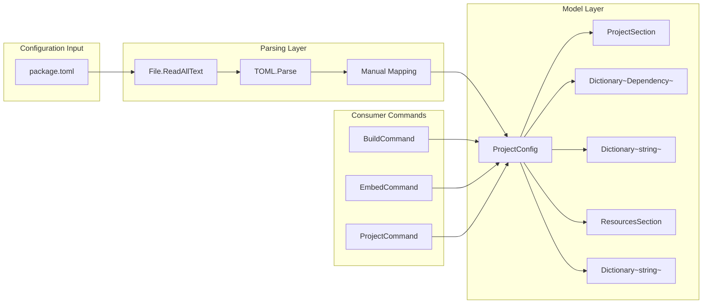

### Resource Embedding Data Flow

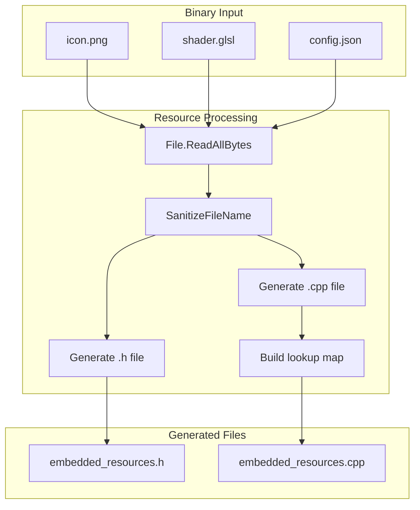

---

## Extension Points

### Lua Scripting Extensions

Users can extend Forge's behavior through Lua scripts in the following directories:

```
.config/forge/
├── commands/          # Future: custom CLI commands
├── build/            # Build-time scripts (*.lua)
├── templates/        # Code generation templates
└── definitions/     # Environment definitions
```

### Adding New Lua Functions

To add a new Lua function:

```csharp
// In LuaEngine.cs, add to SetDefinitionTables()

private static void SetDefinitionTables(ref LuaState state)
{
    // Existing code...
    
    // Add new function
    var myFunc = new LuaFunction("my_function", (context, token) =>
    {
        var arg1 = context.GetArgument<string>(0);
        // Implementation
        AnsiConsole.MarkupLine($"[bold]Function called:[/] {arg1}");
        return ValueTask.FromResult(0);
    });
    
    _cpm[new LuaValue("my_function")] = new LuaValue(myFunc);
}
```

### Custom Code Generation

To add new code generation templates:

1. Add template files to `.config/forge/templates/`
2. Create corresponding command in `Commands/NewCommand.cs`
3. Use string interpolation or template engine for generation

---

## Dependency Analysis

### External Package Dependencies

| Package | Version | Purpose | Used By |
|---------|---------|---------|---------|
| DotMake.CommandLine | 2.0.0 | CLI framework | All commands |
| Tommy | 3.1.2 | TOML parsing | ProjectConfigManager |
| Spectre.Console | 0.50.0 | Terminal UI | All commands, Utils |
| LuaCSharp | 0.5.0 | Lua sandbox | LuaEngine, LuaBuilder |

### Runtime Dependencies (External Tools)

| Tool | Purpose | Called By |
|------|---------|-----------|
| CMake | Build system | BuildCommand |
| Conan | Package manager | InstallCommand |
| Git | Repository operations | LuaEngine.pull_repo |
| bash | Script execution | RunCommand |

---

## Platform Support

### Supported Platforms

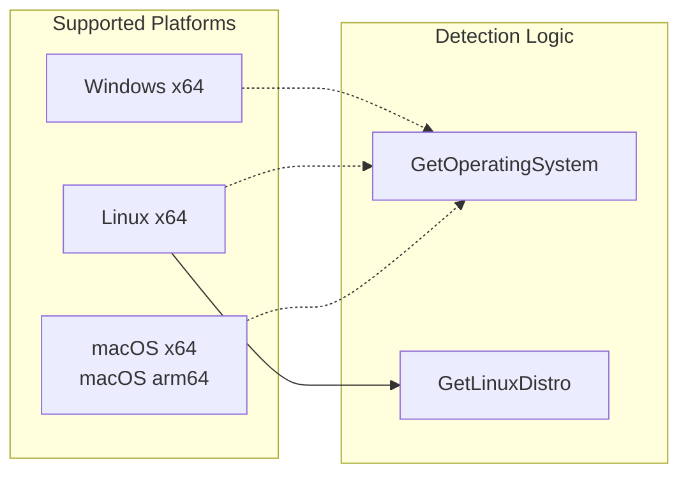

### Platform Detection Implementation

```csharp
// LuaEngine.cs
private static string GetOperatingSystem()
{
    if (OperatingSystem.IsLinux()) return "linux";
    if (OperatingSystem.IsMacOS()) return "macos";
    if (OperatingSystem.IsWindows()) return "windows";
    return string.Empty;
}

private static string GetLinuxDistro()
{
    var lines = File.ReadAllLines("/etc/os-release");
    // Parse ID= field and map to canonical name
    return name switch
    {
        var n when n.Contains("arch") => "arch",
        var n when n.Contains("ubuntu") => "ubuntu",
        var n when n.Contains("fedora") => "fedora",
        // ... etc
    };
}
```

### Platform-Specific Behaviors

| Feature | Windows | Linux | macOS |
|---------|---------|-------|-------|
| Package managers | winget, choco | apt-get, pacman, brew | brew |
| Path separator | `\` | `/` | `/` |
| CMake generator | Default | Default | Default |
| Symlinks | cmd /c mklink | ln -s | ln -s |

---

## Error Handling

### Common Error Scenarios

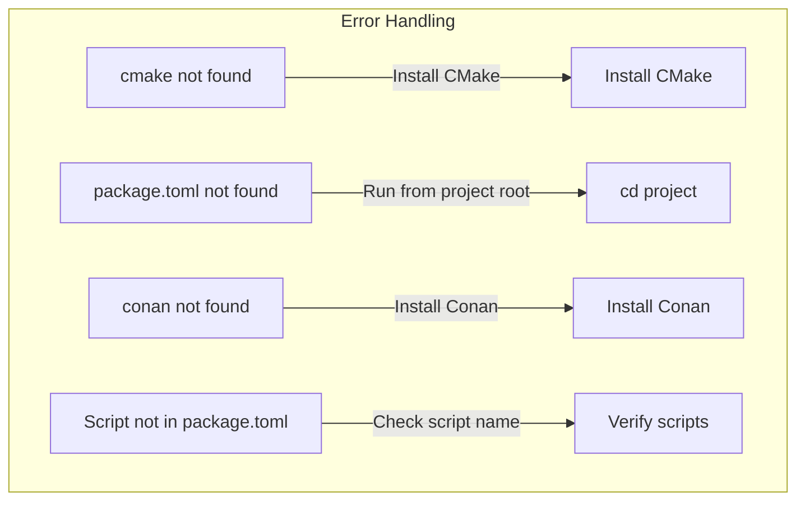

### Error Messages

| Scenario | Error Message | Solution |
|----------|---------------|----------|
| CMake not found | `Error: cmake command not found. Please ensure CMake is installed.` | Install CMake |
| No package.toml | `Error: Not a forge project. package.toml not found.` | Run from project directory |
| Invalid dependency | `Warning: Skipping invalid dependency 'name'. 'git' and 'tag' are required.` | Fix dependency format |
| Script not found | `Error: Script 'scriptname' not found in package.toml.` | Check script name |
| File not found | `Error: File not found at 'path'.` | Check file path |

---

## Performance Considerations

### Build Performance

- **Lazy Config Loading**: Configuration is only loaded when needed
- **Incremental CMake**: Only regenerates CMakeLists.txt when config changes
- **Parallel Build**: Uses CMake's default parallel building

### Memory Usage

- **Static State**: ProjectBuildManager uses static lists that persist across commands
- **Lua State**: Single LuaState instance shared across all operations
- **Resource Loading**: Binary resources are read once and embedded at compile time
