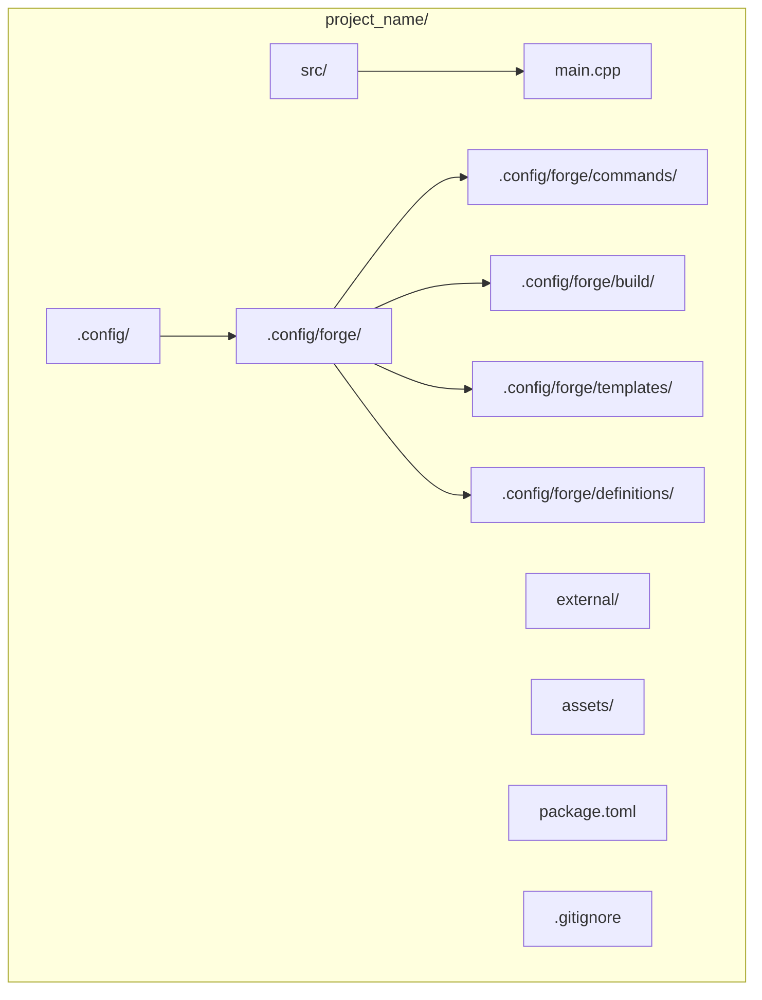
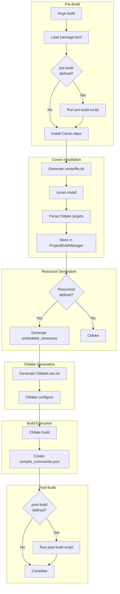
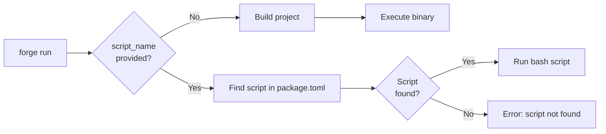
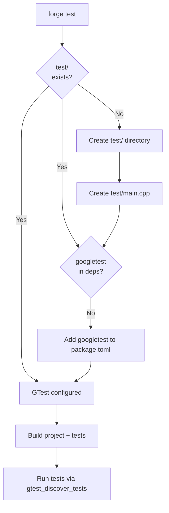
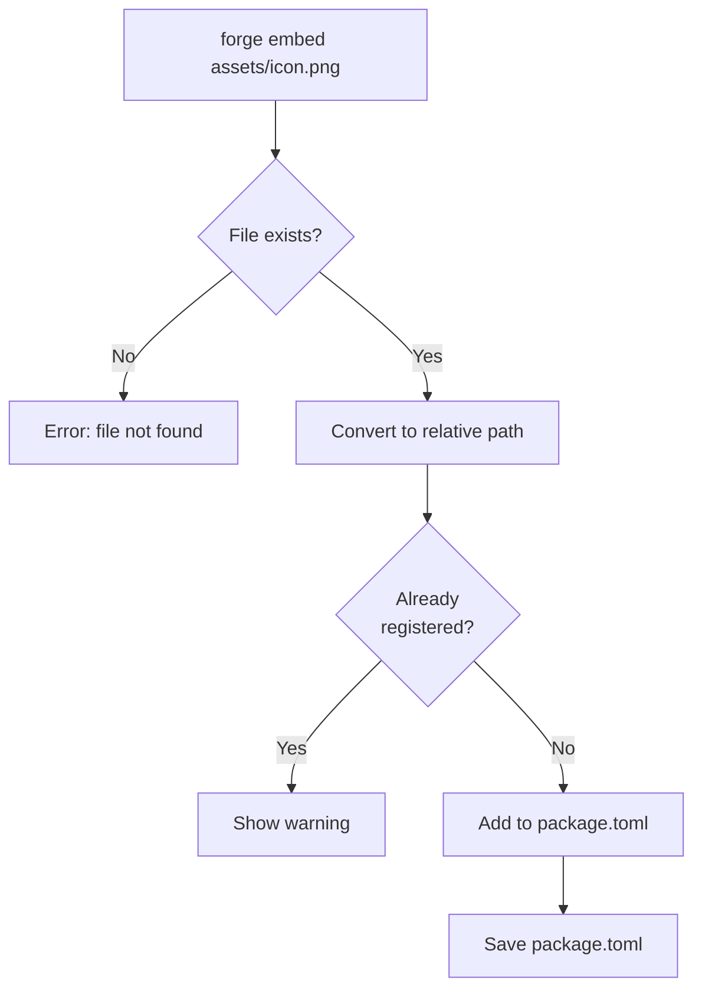
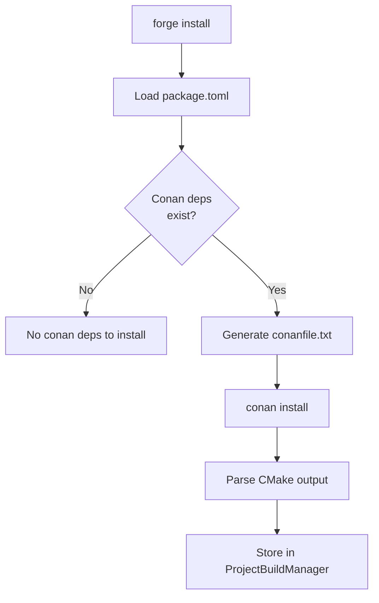
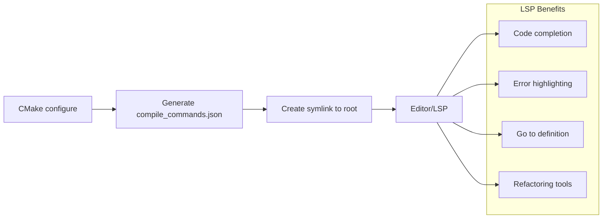

# Forge Functionality Documentation

## Table of Contents

1. [Command Reference](#command-reference)
2. [Configuration Guide](#configuration-guide)
3. [Resource Management](#resource-management)
4. [Lua Scripting](#lua-scripting)
5. [Testing](#testing)
6. [Editor Integration](#editor-integration)
7. [Best Practices](#best-practices)

---

## Command Reference

### Project Lifecycle Commands

#### `forge create <project_name>`

Creates a new C++ project with standard directory structure and initial configuration.

**Syntax**:
```bash
forge create <project_name> [options]
```

**Arguments**:
| Argument | Type | Required | Description |
|----------|------|----------|-------------|
| `project_name` | string | Yes | Name of the project to create |

**Options**:
| Option | Type | Default | Description |
|--------|------|---------|-------------|
| `--type` | string | "executable" | Project type: `executable` or `library` |

**Directory Structure Created**:



**Generated Files**:

1. **package.toml** (executable):
```toml
[project]
name = "project_name"
type = "executable"
```

2. **package.toml** (library):
```toml
[project]
name = "project_name"
type = "library"
install_headers = true
```

3. **src/main.cpp** (executable only):
```cpp
#include <iostream>

int main() {
    std::cout << "Hello, C++ World!" << std::endl;
    return 0;
}
```

4. **.gitignore**:
```
build/
lib/
compile_commands.json
.config/
conanfile.txt
```

**Examples**:
```bash
# Create executable project
forge create my_game

# Create library project
forge create my_library --type library
```

---

#### `forge build`

Generates CMakeLists.txt and builds the project using CMake.

**Syntax**:
```bash
forge build [options]
```

**Options**:
| Option | Type | Default | Description |
|--------|------|---------|-------------|
| `--verbose` | flag | false | Show verbose CMake output |
| `--standard` | string | "20" | C++ standard: 11, 14, 17, 20 |

**Detailed Process**:



**Examples**:
```bash
# Standard build
forge build

# Verbose build
forge build --verbose

# Build with C++17
forge build --standard 17
```

---

#### `forge run [script_name]`

Runs the project executable or a custom script defined in package.toml.

**Syntax**:
```bash
forge run [script_name]
```

**Arguments**:
| Argument | Type | Required | Description |
|----------|------|----------|-------------|
| `script_name` | string | No | Name of script to run |

**Behavior**:



**Examples**:
```bash
# Build and run project
forge run

# Run pre-defined script
forge run compile-shaders

# Run post-build hook explicitly
forge run post-build
```

---

#### `forge test`

Builds and runs tests using Google Test framework.

**Syntax**:
```bash
forge test
```

**Process**:



**Test Setup**:

If Google Test is not configured, Forge automatically:
1. Creates `test/` directory
2. Creates `test/main.cpp` with basic test
3. Adds `googletest` dependency to package.toml

**Test Main Template**:
```cpp
#include <gtest/gtest.h>

// Demonstrate some basic assertions.
TEST(HelloTest, BasicAssertions) {
    // Expect two strings not to be equal.
    EXPECT_STRNE("hello", "world");
    // Expect equality.
    EXPECT_EQ(7 * 6, 42);
}
```

---

#### `forge clean`

Removes the build directory and associated files.

**Syntax**:
```bash
forge clean
```

**Files Removed**:
- `build/` directory
- (CMake cache and build artifacts)

**Files Preserved**:
- Source files
- package.toml
- compile_commands.json (if manually created)

---

### Code Generation Commands

#### `forge new class <ClassName>`

Generates a new C++ class with header and source files.

**Syntax**:
```bash
forge new class <ClassName>
```

**Arguments**:
| Argument | Type | Description |
|----------|------|-------------|
| `ClassName` | string | Name of the class to generate |

**Generated Files**:

1. **src/ClassName.h**:
```cpp
#ifndef CLASSNAME_H
#define CLASSNAME_H

class ClassName {
public:
    ClassName();
    ~ClassName();
};

#endif // CLASSNAME_H
```

2. **src/ClassName.cpp**:
```cpp
#include "ClassName.h"

ClassName::ClassName() {
    // Constructor implementation
}

ClassName::~ClassName() {
    // Destructor implementation
}
```

**Example**:
```bash
forge new class Player
# Creates src/Player.h and src/Player.cpp
```

---

#### `forge new struct <StructName>`

Generates a new C++ struct header file.

**Syntax**:
```bash
forge new struct <StructName>
```

**Arguments**:
| Argument | Type | Description |
|----------|------|-------------|
| `StructName` | string | Name of the struct |

**Generated File**:
```cpp
#ifndef STRUCTNAME_H
#define STRUCTNAME_H

struct StructName {
    // Add member variables here
};

#endif // STRUCTNAME_H
```

---

#### `forge new header <FileName>`

Generates a header file with include guards.

**Syntax**:
```bash
forge new header <FileName>
```

**Arguments**:
| Argument | Type | Description |
|----------|------|-------------|
| `FileName` | string | Name of the header (without extension) |

**Generated File**:
```cpp
#ifndef FILENAME_H
#define FILENAME_H

// Add declarations here

#endif // FILENAME_H
```

---

#### `forge new source <FileName>`

Generates a header and source file pair.

**Syntax**:
```bash
forge new source <FileName>
```

**Arguments**:
| Argument | Type | Description |
|----------|------|-------------|
| `FileName` | string | Name of the file |

**Generated Files**:
- `src/FileName.h` - Header file
- `src/FileName.cpp` - Source file

---

### Resource Management Commands

#### `forge embed <file_path>`

Registers a resource file to be embedded in the executable.

**Syntax**:
```bash
forge embed <file_path>
```

**Arguments**:
| Argument | Type | Description |
|----------|------|-------------|
| `file_path` | string | Path to the resource file |

**Process**:



**Example**:
```bash
# Embed an image
forge embed assets/icon.png

# Embed a shader
forge embed assets/shaders/basic.glsl

# Embed a config file
forge embed assets/config.json
```

---

### Project Information Commands

#### `forge project info`

Displays project configuration summary.

**Output Example**:
```
=== Project Info ===

Name: my_game
Type: executable
C++ Standard: 20

Dependencies (Git):
  - sdl: https://github.com/libsdl-org/SDL.git (release-2.30.3)

Dependencies (Conan):
  - fmt: 10.2.1
  - spdlog: 1.12.0

Resources:
  - assets/icon.png
  - assets/shader.glsl
```

---

#### `forge project tree`

Displays project file structure.

**Output Example**:
```
my_game/
├── src/
│   ├── main.cpp
│   ├── Player.h
│   ├── Player.cpp
│   ├── embedded_resources.h
│   └── embedded_resources.cpp
├── assets/
│   ├── icon.png
│   └── shader.glsl
├── external/
├── test/
│   └── main.cpp
├── package.toml
└── CMakeLists.txt
```

---

#### `forge project stats`

Displays project statistics.

**Output Example**:
```
=== Project Statistics ===

Total Files: 15
Source Files (.cpp): 5
Header Files (.h): 4
Test Files: 1
Resource Files: 2
```

---

#### `forge project dependencies`

Lists all project dependencies.

**Output Example**:
```
=== Dependencies ===

Git Dependencies:
  - sdl: https://github.com/libsdl-org/SDL.git
    Tag: release-2.30.3
    Target: SDL2::SDL2
  
  - fmt: https://github.com/fmtlib/fmt.git
    Tag: 10.2.1
    Target: fmt

Conan Dependencies:
  - fmt: 10.2.1
  - spdlog: 1.12.0
```

---

#### `forge project scripts`

Lists available scripts from package.toml.

**Output Example**:
```
=== Available Scripts ===

pre-build:
  echo "Building project..."

post-build:
  echo "Build complete!"

compile-shaders:
  python3 scripts/compile_shaders.py
```

---

### Package Management Commands

#### `forge install`

Installs Conan dependencies defined in package.toml.

**Syntax**:
```bash
forge install
```

**Process**:



**conanfile.txt Generation**:
```toml
[requires]
fmt/10.2.1
spdlog/1.12.0

[generators]
CMakeDeps
CMakeToolchain

[layout]
cmake_layout
```

---

## Configuration Guide

### package.toml Reference

#### Project Section

```toml
[project]
name = "my_project"           # Required: project identifier
type = "executable"           # Required: "executable" or "library"
install_headers = false       # Optional: for libraries, install headers
```

#### Dependencies Section

Git-based dependencies using CMake FetchContent:

```toml
[dependencies]
# Basic format
package_name = { git = "url", tag = "version" }

# Full format with CMake target
package_name = { 
    git = "https://github.com/user/repo.git", 
    tag = "v1.0.0",
    target = "Package::Target"
}

# Examples
sdl = { git = "https://github.com/libsdl-org/SDL.git", tag = "release-2.30.3", target = "SDL2::SDL2" }
fmt = { git = "https://github.com/fmtlib/fmt.git", tag = "10.2.1" }
```

**Dependency Fields**:
| Field | Required | Description |
|-------|----------|-------------|
| `git` | Yes | Git repository URL |
| `tag` | Yes | Git tag or branch |
| `target` | No | CMake target name (defaults to package name) |

#### Conan Dependencies Section

```toml
[conan-dependencies]
# Format: package = "version"
fmt = "10.2.1"
spdlog = "1.12.0"
nlohmann_json = "3.10.5"
```

#### Resources Section

```toml
[resources]
files = [
    "assets/icon.png",
    "assets/shader.glsl",
    "assets/config.json"
]
```

#### Scripts Section

```toml
[scripts]
# Pre-build script
pre-build = "echo 'Starting build...'"

# Post-build script  
post-build = "echo 'Build finished!'"

# Custom scripts
compile-shaders = "python3 scripts/compile_shaders.py"
copy-assets = "cp -r assets build/"
```

---

## Resource Management

### Embedding Resources

#### How It Works

```mermaid
flowchart LR
    subgraph Define["Define Resources"]
        Config[package.toml]
    end
    
    subgraph Embed["Embed Process"]
        EmbedCmd[forge embed]
        Generate[Utils.GenerateResourceFiles]
        Build[forge build]
    end
    
    subgraph Use["Use in Code"]
        Include[#include]
        Call[Embedded::get()]
    end
    
    Config --> EmbedCmd
    EmbedCmd --> Generate
    Generate --> Build
    
    Build --> Include
    Include --> Call
```

#### Using Embedded Resources

After embedding, resources are accessible via the generated API:

```cpp
#include "embedded_resources.h"
#include <iostream>

int main() {
    try {
        // Get resource by filename
        const auto& resource = Embedded::get("icon.png");
        
        // Access data and size
        const unsigned char* data = resource.data;
        size_t size = resource.size;
        
        std::cout << "Resource size: " << size << " bytes" << std::endl;
    }
    catch (const std::out_of_range& e) {
        std::cerr << "Resource not found: " << e.what() << std::endl;
    }
    
    return 0;
}
```

#### Resource File Format

The embedding system supports any binary file:

| File Type | Example | Use Case |
|-----------|---------|-----------|
| Images | .png, .jpg, .bmp | Textures, icons |
| Shaders | .glsl, .hlsl | GPU shaders |
| Config | .json, .xml, .yaml | Configuration |
| Fonts | .ttf, .otf | Embedded fonts |
| Audio | .wav, .ogg | Sound effects |

---

## Lua Scripting

### Build Scripts

Place `.lua` files in `.config/forge/build/` to execute during the build process.

#### Example: Custom Build Script

```lua
-- .config/forge/build/custom_setup.lua

forge.log.info("Running custom build setup")

-- Clone required dependencies
forge.pull_repo("https://github.com/nlohmann/json.git")

-- Install system packages (example for Ubuntu)
forge.get_packages("nopass", forge.package_manager.aptget, {"libsdl2-dev"})

-- Platform-specific setup
if forge.os.current == "windows" then
    forge.log.info("Running Windows-specific setup")
elseif forge.os.current == "linux" then
    if forge.distro.my_distro == "ubuntu" then
        forge.log.info("Running Ubuntu-specific setup")
    end
end

forge.log.info("Custom setup complete!")
```

#### Example: Multi-Platform Build

```lua
-- .config/forge/build/platform_setup.lua

forge.log.info("Platform: " .. forge.os.current)
forge.log.info("Distro: " .. forge.distro.my_distro)

-- Install SDL2 based on platform
if forge.os.windows then
    forge.get_packages("nopass", forge.package_manager.chocolatey, {"sdl2"})
elseif forge.os.macos then
    forge.get_packages("nopass", forge.package_manager.brew, {"sdl2"})
elseif forge.os.linux then
    local distro = forge.distro.my_distro
    if distro == "ubuntu" or distro == "debian" then
        forge.get_packages("nopass", forge.package_manager.aptget, {"libsdl2-dev"})
    elseif distro == "arch" or distro == "manjaro" then
        forge.get_packages("nopass", forge.package_manager.pacman, {"sdl2"})
    elseif distro == "fedora" then
        forge.get_packages("nopass", forge.package_manager.aptget, {"SDL2-devel"})
    end
end
```

### Environment API Reference

#### Operating System

```lua
-- Current OS detection
forge.os.current        -- Returns: "linux", "macos", or "windows"

-- OS checks
forge.os.windows       -- Returns: true/false
forge.os.macos         -- Returns: true/false
forge.os.linux         -- Returns: true/false
```

#### Linux Distribution

```lua
-- Common distributions
forge.distro.ubuntu
forge.distro.debian
forge.distro.arch
forge.distro.manjaro
forge.distro.fedora
forge.distro.nixos
forge.distro.centos

-- Auto-detected current distribution
forge.distro.my_distro   -- Returns detected distro name
```

#### Package Managers

```lua
-- Available package managers
forge.package_manager.brew        -- Homebrew (macOS/Linux)
forge.package_manager.aptget       -- APT (Debian/Ubuntu)
forge.package_manager.pacman       -- Pacman (Arch)
forge.package_manager.winget       -- Winget (Windows)
forge.package_manager.chocolatey   -- Chocolatey (Windows)

-- Special value
forge.package_manager.no_pass      -- "nopass" (no sudo required)
```

#### Functions

```lua
-- Clone a git repository
forge.pull_repo("https://github.com/user/repo.git")

-- Install system packages
-- Signature: get_packages(password, manager, packages_table)
forge.get_packages("nopass", forge.package_manager.brew, {"package1", "package2"})

-- Logging
forge.log.info("This is an info message")
```

---

## Testing

### Test Structure

```
project/
├── test/
│   └── main.cpp      # Test entry point
├── src/
│   ├── main.cpp      # Main application
│   └── ...
└── package.toml
```

### Writing Tests

```cpp
// test/main.cpp
#include <gtest/gtest.h>

// Test suite for a math utility
TEST(MathUtils, Add) {
    EXPECT_EQ(1 + 1, 2);
}

TEST(MathUtils, Multiply) {
    EXPECT_EQ(3 * 4, 12);
}

// Test suite for a class
class PlayerTest : public ::testing::Test {
protected:
    void SetUp() override {
        // Setup code
    }
};

TEST_F(PlayerTest, Initialization) {
    // Test code
}

int main(int argc, char** argv) {
    testing::InitGoogleTest(&argc, argv);
    return RUN_ALL_TESTS();
}
```

### Running Tests

```bash
# Build and run tests
forge test

# With verbose output
forge build --verbose && ./build/run_tests
```

---

## Editor Integration

### LSP Support (compile_commands.json)

Forge automatically generates `compile_commands.json` for Language Server Protocol support.



### VS Code Configuration

```json
// .vscode/c_cpp_properties.json
{
    "configurations": [
        {
            "compileCommands": "${workspaceFolder}/compile_commands.json",
            "cppStandard": "c++20",
            "includePath": [
                "${workspaceFolder}/**",
                "${workspaceFolder}/src"
            ]
        }
    ]
}
```

### Neovim Configuration

```lua
-- Using nvim-lspconfig
require('lspconfig').clangd.setup {
    capabilities = capabilities,
    cmd = { "clangd" },
    filetypes = { "c", "cpp" },
}
```

---

## Best Practices

### Project Structure

```
my_project/
├── src/                    # Source code
│   ├── main.cpp
│   ├── *.cpp
│   └── *.h
├── include/                # Public headers (libraries)
│   └── my_project/
├── test/                   # Test files
│   └── main.cpp
├── assets/                 # Resources
│   ├── images/
│   ├── shaders/
│   └── configs/
├── external/              # Git dependencies
├── scripts/               # Build scripts
├── package.toml          # Project configuration
└── CMakeLists.txt        # (auto-generated)
```

### Dependency Management

1. **Use Conan for**:
   - Large, complex libraries (Boost, Qt)
   - Libraries with complex build systems
   - Binary packages with pre-compiled artifacts

2. **Use Git Dependencies for**:
   - Small, header-only libraries
   - Project-specific forks
   - Libraries without Conan recipes

### Scripts Usage

```toml
[scripts]
# Use for:
# - Compiling shaders
# - Copying assets to build directory
# - Running code generators
# - Generating version info

pre-build = "python3 scripts/generate_version.py"
post-build = "python3 scripts/package.py"
```

### Resource Management

1. **Always use relative paths** in package.toml
2. **Use descriptive resource names** in code
3. **Handle missing resources gracefully**

---

## Troubleshooting

### Common Issues

| Issue | Cause | Solution |
|-------|-------|----------|
| `cmake not found` | CMake not installed | Install CMake |
| `package.toml not found` | Not in project root | `cd` to project directory |
| `conan not found` | Conan not installed | Install Conan |
| Build fails | Missing dependency | Check package.toml |
| Resource not found | Wrong path | Use relative paths |

### Debug Commands

```bash
# Check project configuration
forge project info

# View dependency tree
forge project dependencies

# List available scripts
forge project scripts

# Verbose build output
forge build --verbose
```
