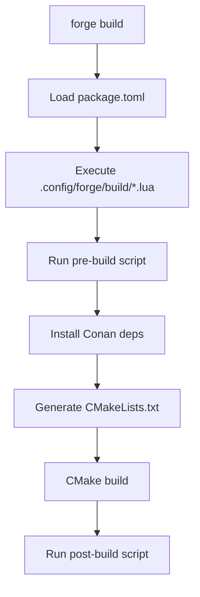

# Forge Lua Engine Testing Plan

## Table of Contents

1. [Overview](#overview)
2. [Lua Scripting Basics](#lua-scripting-basics)
3. [Project Scenarios](#project-scenarios)
4. [WebGPU Projects](#webgpu-projects)
5. [Graphics Projects](#graphics-projects)
6. [Platform-Specific Projects](#platform-specific-projects)
7. [Advanced Scenarios](#advanced-scenarios)
8. [Running Lua Tests](#running-lua-tests)
9. [Troubleshooting](#troubleshooting)

---

## Overview

This document covers testing scenarios that utilize Forge's Lua engine for build automation. Lua scripts in `.config/forge/build/` are executed during the build process to handle platform-specific setup, dependency management, and custom build configurations.

**Lua Script Locations**:
- `.config/forge/build/*.lua` - Build-time scripts
- `.config/forge/definitions/` - Environment definitions

---

## Lua Scripting Basics

### Available Lua API

```lua
-- Operating System Detection
forge.os.current        -- "linux", "macos", "windows"
forge.os.windows       -- true/false
forge.os.macos         -- true/false
forge.os.linux         -- true/false

-- Linux Distribution
forge.distro.my_distro -- Auto-detected distro
forge.distro.ubuntu
forge.distro.debian
forge.distro.arch
forge.distro.manjaro
forge.distro.fedora
forge.distro.nixos

-- Package Managers
forge.package_manager.brew
forge.package_manager.aptget
forge.package_manager.pacman
forge.package_manager.winget
forge.package_manager.chocolatey
forge.package_manager.nopass

-- Functions
forge.pull_repo(url)                    -- Clone git repository
forge.get_packages(password, manager, packages)  -- Install packages
forge.log.info(message)                 -- Log message

-- Environment
forge.current_working_dir               -- Current directory
```

### Lua Script Execution Flow



---

## Project Scenarios

### Scenario 1: Basic Lua Script Execution

**Purpose**: Verify Lua scripts execute correctly during build.

**Test Steps**:

```bash
# 1. Create project
forge create test_lua_basic

# 2. Create Lua build script
mkdir -p test_lua_basic/.config/forge/build
cat > test_lua_basic/.config/forge/build/setup.lua << 'EOF'
forge.log.info("Hello from Lua!")
forge.log.info("Current OS: " .. forge.os.current)
forge.log.info("Current directory: " .. forge.current_working_dir)
EOF

# 3. Build
cd test_lua_basic
forge build
```

**Verification Points**:
- [ ] Lua script executes before build
- [ ] Log messages appear in output
- [ ] OS detection works correctly
- [ ] No Lua errors during execution

---

### Scenario 2: Git Repository Cloning

**Purpose**: Verify `forge.pull_repo()` function works.

**Test Steps**:

```bash
# 1. Create project
forge create test_git_clone

# 2. Create Lua script to clone repository
cat > test_git_clone/.config/forge/build/deps.lua << 'EOF'
forge.log.info("Cloning dependency repository...")

-- Clone a library (example: nlohmann_json)
forge.pull_repo("https://github.com/nlohmann/json.git")

forge.log.info("Repository cloned successfully!")
EOF

# 3. Build
cd test_git_clone
forge build

# 4. Verify external/ directory
ls -la external/
```

**Verification Points**:
- [ ] Repository cloned to external/ directory
- [ ] Git clone completes without error
- [ ] Repository is usable in CMake

---

### Scenario 3: System Package Installation

**Purpose**: Verify system package installation via Lua.

**Test Steps**:

```bash
# 1. Create project
forge create test_packages

# 2. Create Lua script for package installation
cat > test_packages/.config/forge/build/packages.lua << 'EOF'
forge.log.info("Installing system packages...")

local os_name = forge.os.current
forge.log.info("Detected OS: " .. os_name)

if forge.os.linux then
    local distro = forge.distro.my_distro
    forge.log.info("Detected distro: " .. distro)
    
    if distro == "ubuntu" or distro == "debian" then
        forge.get_packages("nopass", forge.package_manager.aptget, {"libxrandr-dev", "libxinerama-dev"})
    elseif distro == "arch" or distro == "manjaro" then
        forge.get_packages("nopass", forge.package_manager.pacman, {"libxrandr", "libxinerama"})
    elseif distro == "fedora" then
        forge.get_packages("nopass", forge.package_manager.dnf, {"libXrandr-devel", "libXinerama-devel"})
    end
elseif forge.os.macos then
    forge.get_packages("nopass", forge.package_manager.brew, {"xrandr", "xineram-libs"})
elseif forge.os.windows then
    forge.log.info("Windows: Use vcpkg or manual install")
end

forge.log.info("Package installation complete!")
EOF

# 3. Build
cd test_packages
forge build
```

**Verification Points**:
- [ ] OS detection works correctly
- [ ] Distribution detection works (Linux)
- [ ] Correct package manager identified
- [ ] Packages installed successfully (if permission available)

---

## WebGPU Projects

### Scenario 4: WebGPU with wgpu-native (Option A)

**Purpose**: Test WebGPU project setup using pre-compiled wgpu-native.

**Test Steps**:

```bash
# 1. Create project
forge create webgpu_wgpu

# 2. Create Lua build script
cat > webgpu_wgpu/.config/forge/build/webgpu.lua << 'EOF'
forge.log.info("Setting up WebGPU with wgpu-native...")

-- Download WebGPU distribution
local webgpu_url = "https://github.com/eliemichel/WebGPU-distribution/archive/refs/tags/wgpu-v24.0.0.2.zip"

forge.log.info("WebGPU setup complete for wgpu-native backend")
EOF

# 3. Create main.cpp with WebGPU code
cat > webgpu_wgpu/src/main.cpp << 'EOF'
#define WEBGPU_BACKEND_WGPU
#include <webgpu/webgpu.h>
#include <iostream>

int main() {
    WGPUInstanceDescriptor desc = {};
    desc.nextInChain = nullptr;
    
    WGPUInstance instance = wgpuCreateInstance(&desc);
    
    if (!instance) {
        std::cerr << "Could not initialize WebGPU!" << std::endl;
        return 1;
    }
    
    std::cout << "WGPU instance: " << instance << std::endl;
    
    wgpuInstanceRelease(instance);
    std::cout << "WebGPU test passed!" << std::endl;
    return 0;
}
EOF

# 4. Download WebGPU headers manually (Lua can't download zip easily)
cd webgpu_wgpu
curl -L -o webgpu.zip "https://github.com/eliemichel/WebGPU-distribution/archive/refs/tags/wgpu-v24.0.0.2.zip"
unzip -o webgpu.zip
mv WebGPU-distribution-* webgpu
rm webgpu.zip

# 5. Edit package.toml to include webgpu
cat > package.toml << 'EOF'
[project]
name = "webgpu_wgpu"
type = "executable"

[dependencies]

[resources]
EOF

# 6. Create CMakeLists.txt manually or use build script
forge build
```

**Verification Points**:
- [ ] WebGPU headers found
- [ ] wgpu-native library linked
- [ ] Instance creation succeeds
- [ ] Application runs without errors

---

### Scenario 5: WebGPU with Dawn (Option B)

**Purpose**: Test WebGPU project setup using Dawn backend.

**Test Steps**:

```bash
# 1. Create project
forge create webgpu_dawn

# 2. Create Lua build script for Dawn
cat > webgpu_dawn/.config/forge/build/webgpu.lua << 'EOF'
forge.log.info("Setting up WebGPU with Dawn backend...")

-- Dawn requires additional system packages
if forge.os.linux then
    forge.log.info("Installing Dawn dependencies...")
    
    local distro = forge.distro.my_distro
    if distro == "ubuntu" or distro == "debian" then
        forge.get_packages("nopass", forge.package_manager.aptget, {
            "libxrandr-dev",
            "libxinerama-dev", 
            "libxcursor-dev",
            "mesa-common-dev",
            "libx11-xcb-dev",
            "pkg-config"
        })
    end
end

forge.log.info("Dawn dependencies installed!")
EOF

# 3. Download Dawn distribution
cd webgpu_dawn
curl -L -o dawn.zip "https://github.com/eliemichel/WebGPU-distribution/archive/refs/tags/dawn-6536.zip"
unzip -o dawn.zip
mv WebGPU-distribution-* webgpu
rm dawn.zip

# 4. Create source files
cat > src/main.cpp << 'EOF'
#define WEBGPU_BACKEND_DAWN
#include <webgpu/webgpu.h>
#include <iostream>

int main() {
    WGPUInstanceDescriptor desc = {};
    WGPUInstance instance = wgpuCreateInstance(&desc);
    
    if (!instance) {
        std::cerr << "Could not initialize WebGPU with Dawn!" << std::endl;
        return 1;
    }
    
    std::cout << "Dawn WGPU instance: " << instance << std::endl;
    wgpuInstanceRelease(instance);
    
    std::cout << "Dawn WebGPU test passed!" << std::endl;
    return 0;
}
EOF

# 5. Build
forge build
```

**Verification Points**:
- [ ] Dawn dependencies installed via Lua
- [ ] Dawn library built/found
- [ ] Instance creation succeeds
- [ ] Better error messages available

---

### Scenario 6: WebGPU with Dynamic Backend Selection (Option C)

**Purpose**: Test WebGPU project with runtime backend selection.

**Test Steps**:

```bash
# 1. Create project
forge create webgpu_flex

# 2. Create Lua script for flexible backend
cat > webgpu_flex/.config/forge/build/webgpu.lua << 'EOF'
forge.log.info("Setting up WebGPU with flexible backend...")

-- Check for WEBGPU_BACKEND environment variable or default to WGPU
local backend = os.getenv("WEBGPU_BACKEND") or "WGPU"
forge.log.info("Using WebGPU backend: " .. backend)

-- This could set CMake options dynamically
cmakeOptions = {
    backend = backend
}

forge.log.info("WebGPU backend configuration complete")
EOF

# 3. Download combined distribution
cd webgpu_flex
curl -L -o webgpu.zip "https://github.com/eliemichel/WebGPU-distribution/archive/refs/tags/main-v0.2.0.zip"
unzip -o webgpu.zip
mv WebGPU-distribution-* webgpu
rm webgpu.zip

# 4. Create source
cat > src/main.cpp << 'EOF'
#include <webgpu/webgpu.h>
#include <iostream>

int main() {
    WGPUInstanceDescriptor desc = {};
    WGPUInstance instance = wgpuCreateInstance(&desc);
    
    if (!instance) {
        std::cerr << "Could not initialize WebGPU!" << std::endl;
        return 1;
    }
    
#ifdef WEBGPU_BACKEND_DAWN
    std::cout << "Using Dawn backend" << std::endl;
#elif defined(WEBGPU_BACKEND_WGPU)
    std::cout << "Using wgpu-native backend" << std::endl;
#endif
    
    wgpuInstanceRelease(instance);
    std::cout << "Flexible WebGPU test passed!" << std::endl;
    return 0;
}
EOF

# 5. Build with specific backend
WEBGPU_BACKEND=DAWN forge build
# or
WEBGPU_BACKEND=WGPU forge build
```

**Verification Points**:
- [ ] Lua reads environment variables
- [ ] Backend selection works
- [ ] Can build both backends in separate directories

---

## Graphics Projects

### Scenario 7: SDL2 with Platform Detection

**Purpose**: Test SDL2 setup with platform-specific Lua script.

**Test Steps**:

```bash
# 1. Create project
forge create sdl2_platform

# 2. Create Lua build script
cat > sdl2_platform/.config/forge/build/sdl2.lua << 'EOF'
forge.log.info("Setting up SDL2 for platform...")

local os_name = forge.os.current
forge.log.info("Building for: " .. os_name)

if forge.os.linux then
    local distro = forge.distro.my_distro
    forge.log.info("Linux distro: " .. distro)
    
    if distro == "ubuntu" or distro == "debian" then
        forge.get_packages("nopass", forge.package_manager.aptget, {"libsdl2-dev", "libsdl2-image-dev"})
    elseif distro == "arch" or distro == "manjaro" then
        forge.get_packages("nopass", forge.package_manager.pacman, {"sdl2", "sdl2_image"})
    elseif distro == "fedora" then
        forge.get_packages("nopass", forge.package_manager.dnf, {"SDL2-devel", "SDL2_image-devel"})
    end
elseif forge.os.macos then
    forge.get_packages("nopass", forge.package_manager.brew, {"sdl2", "sdl2_image"})
elseif forge.os.windows then
    forge.log.info("Windows: SDL2 should be in package.toml dependencies")
end

forge.log.info("SDL2 setup complete!")
EOF

# 3. Add SDL2 to dependencies
cat > sdl2_platform/package.toml << 'EOF'
[project]
name = "sdl2_platform"
type = "executable"

[dependencies]
sdl = { git = "https://github.com/libsdl-org/SDL.git", tag = "release-2.30.3", target = "SDL2::SDL2" }
EOF

# 4. Build
cd sdl2_platform
forge build
```

**Verification Points**:
- [ ] Platform detection works
- [ ] Correct packages for each distro
- [ ] SDL2 links correctly
- [ ] System packages installed

---

### Scenario 8: OpenGL with Multi-Package Setup

**Purpose**: Test OpenGL project with multiple system dependencies.

**Test Steps**:

```bash
# 1. Create project
forge create opengl_multi

# 2. Create Lua script
cat > opengl_multi/.config/forge/build/opengl.lua << 'EOF'
forge.log.info("Setting up OpenGL development environment...")

if forge.os.linux then
    local distro = forge.distro.my_distro
    local packages = {}
    
    if distro == "ubuntu" or distro == "debian" then
        packages = {
            "libgl1-mesa-dev",
            "libglu1-mesa-dev",
            "libxrandr-dev",
            "libxinerama-dev",
            "libxcursor-dev",
            "libxi-dev",
            "libxxf86vm-dev"
        }
    elseif distro == "arch" or distro == "manjaro" then
        packages = {
            "mesa",
            "glu",
            "libxrandr",
            "libxinerama",
            "libxcursor",
            "libxi",
            "libxxf86vm"
        }
    end
    
    if #packages > 0 then
        forge.log.info("Installing " .. #packages .. " packages...")
        forge.get_packages("nopass", forge.package_manager.aptget, packages)
    end
elseif forge.os.macos then
    forge.log.info("macOS: OpenGL is system-provided")
elseif forge.os.windows then
    forge.log.info("Windows: Install via vcpkg or download from NVIDIA/AMD")
end

forge.log.info("OpenGL setup complete!")
EOF

# 3. Build
cd opengl_multi
forge build
```

**Verification Points**:
- [ ] Multiple packages installed
- [ ] OpenGL headers found
- [ ] GLU headers found
- [ ] X11 development files present

---

### Scenario 9: Vulkan Project Setup

**Purpose**: Test Vulkan SDK setup via Lua.

**Test Steps**:

```bash
# 1. Create project
forge create vulkan_setup

# 2. Create Lua script for Vulkan
cat > vulkan_setup/.config/forge/build/vulkan.lua << 'EOF'
forge.log.info("Setting up Vulkan SDK...")

if forge.os.linux then
    local distro = forge.distro.my_distro
    
    if distro == "ubuntu" or distro == "debian" then
        -- Try to install Vulkan SDK via apt or use LunarG
        forge.get_packages("nopass", forge.package_manager.aptget, {
            "vulkan-tools",
            "libvulkan-dev",
            "spirv-tools",
            "glslang-tools"
        })
        
        forge.log.info("Vulkan SDK installed via apt")
    elseif distro == "arch" or distro == "manjaro" then
        forge.get_packages("nopass", forge.package_manager.pacman, {
            "vulkan-devel",
            "spirv-tools",
            "glslang"
        })
    else
        forge.log.info("Please install Vulkan SDK manually from vulkan.lunarg.com")
    end
elseif forge.os.macos then
    forge.log.info("macOS: Install Vulkan SDK from vulkan.lunarg.com")
elseif forge.os.windows then
    forge.log.info("Windows: Install Vulkan SDK from vulkan.lunarg.com")
end

forge.log.info("Vulkan setup attempted!")
EOF

# 3. Add Vulkan to package.toml
cat > vulkan_setup/package.toml << 'EOF'
[project]
name = "vulkan_setup"
type = "executable"

[dependencies]
vulkan = { git = "https://github.com/KhronosGroup/Vulkan-Headers.git", tag = "v1.3.280" }
EOF

# 4. Build
cd vulkan_setup
forge build
```

**Verification Points**:
- [ ] Vulkan headers available
- [ ] SPIRV tools present
- [ ] GLSLang compiler available

---

## Platform-Specific Projects

### Scenario 10: Windows-Specific Build (Winget/Chocolatey)

**Purpose**: Test Windows package manager usage in Lua.

**Test Steps**:

```powershell
# 1. Create project (on Windows)
forge create windows_deps

# 2. Create Lua script
cat > windows_deps/.config/forge/build/windows.lua << 'EOF'
forge.log.info("Setting up Windows dependencies...")

if forge.os.windows then
    local use_choco = os.getenv("USE_CHOCOLATEY")
    local use_winget = os.getenv("USE_WINGET")
    
    if use_choco == "1" then
        forge.log.info("Using Chocolatey...")
        forge.get_packages("nopass", forge.package_manager.chocolatey, {
            "cmake",
            "vcpkg",
            "git"
        })
    else
        forge.log.info("Using Winget...")
        forge.get_packages("nopass", forge.package_manager.winget, {
            "Git.Git",
            "Kitware.CMake"
        })
    end
else
    forge.log.info("This script is for Windows only!")
end
EOF

# 3. Build
cd windows_deps
forge build
```

**Verification Points**:
- [ ] Windows OS detected correctly
- [ ] Package manager identified
- [ ] Packages installed (if running as administrator)

---

### Scenario 11: macOS-Specific Build (Homebrew)

**Purpose**: Test macOS Homebrew integration.

**Test Steps**:

```bash
# 1. Create project
forge create macos_brew

# 2. Create Lua script
cat > macos_brew/.config/forge/build/macos.lua << 'EOF'
forge.log.info("Setting up macOS dependencies...")

if forge.os.macos then
    forge.log.info("Using Homebrew...")
    
    -- Install common dependencies
    forge.get_packages("nopass", forge.package_manager.brew, {
        "sdl2",
        "glm",
        "glfw",
        "assimp"
    })
    
    forge.log.info("Homebrew packages installed!")
else
    forge.log.info("This script is for macOS only!")
end
EOF

# 3. Add dependencies to package.toml
cat > macos_brew/package.toml << 'EOF'
[project]
name = "macos_brew"
type = "executable"

[dependencies]
glfw = { git = "https://github.com/glfw/glfw.git", tag = "3.4" }
EOF

# 4. Build
cd macos_brew
forge build
```

**Verification Points**:
- [ ] macOS detected correctly
- [ ] Homebrew packages installed
- [ ] Build succeeds with Homebrew libraries

---

### Scenario 12: Cross-Platform Project

**Purpose**: Test unified Lua script handling all platforms.

**Test Steps**:

```bash
# 1. Create project
forge create cross_platform

# 2. Create comprehensive Lua script
cat > cross_platform/.config/forge/build/cross_platform.lua << 'EOF'
-- Cross-platform build script
forge.log.info("===========================================")
forge.log.info("Cross-Platform Build Configuration")
forge.log.info("===========================================")

local os_name = forge.os.current
forge.log.info("Target OS: " .. os_name)

-- Detect and log detailed system info
if forge.os.linux then
    local distro = forge.distro.my_distro
    forge.log.info("Linux Distribution: " .. distro)
    
    -- Install common dependencies based on distro
    local packages = {}
    
    if distro == "ubuntu" or distro == "debian" then
        packages = {"build-essential", "cmake", "git"}
    elseif distro == "arch" or distro == "manjaro" then
        packages = {"base-devel", "cmake", "git"}
    elseif distro == "fedora" then
        packages = {"gcc-c++", "cmake", "git"}
    elseif distro == "nixos" then
        forge.log.info("NixOS: Dependencies managed via nix-env")
    end
    
    if #packages > 0 then
        forge.log.info("Installing base packages: " .. table.concat(packages, ", "))
        forge.get_packages("nopass", forge.package_manager.aptget, packages)
    end
    
elseif forge.os.macos then
    forge.log.info("macOS Version: " .. (os.getenv("MACOSX_DEPLOYMENT_TARGET") or "default"))
    forge.get_packages("nopass", forge.package_manager.brew, {"cmake", "git", "pkg-config"})
    
elseif forge.os.windows then
    forge.log.info("Windows: Ensure Visual Studio or MinGW installed")
    forge.log.info("Consider using: winget install Microsoft.VisualStudio.2022.BuildTools")
end

forge.log.info("Base environment setup complete!")
forge.log.info("===========================================")
EOF

# 3. Build on different platforms
cd cross_platform
forge build

# Test on Linux container or CI
# docker run -it ubuntu:latest /bin/bash
# Then run forge build
```

**Verification Points**:
- [ ] Correct OS detection on all platforms
- [ ] Distro detection works on Linux
- [ ] Appropriate packages for each platform
- [ ] Build succeeds on all supported platforms

---

## Advanced Scenarios

### Scenario 13: Custom CMake Options via Lua

**Purpose**: Test passing CMake options from Lua.

**Test Steps**:

```bash
# 1. Create project
forge create cmake_options

# 2. Create Lua script with CMake options
cat > cmake_options/.config/forge/build/cmake_options.lua << 'EOF'
forge.log.info("Configuring CMake options...")

-- Define custom CMake options
cmakeOptions = {
    -- Build type
    CMAKE_BUILD_TYPE = "Debug",  -- or "Release"
    
    -- Custom defines
    MY_OPTION = "ON",
    
    -- Extra include directories
    extra_includes = {"/path/to/includes"},
    
    -- Extra libraries
    extra_libs = {"mylib"}
}

forge.log.info("CMake options configured:")
forge.log.info("  CMAKE_BUILD_TYPE: " .. cmakeOptions.CMAKE_BUILD_TYPE)
forge.log.info("  MY_OPTION: " .. cmakeOptions.MY_OPTION)
EOF

# 3. Build
cd cmake_options
forge build --verbose
```

**Verification Points**:
- [ ] CMake options set correctly
- [ ] Custom defines available in CMake
- [ ] Build type applied

---

### Scenario 14: Conditional Dependency Loading

**Purpose**: Test Lua-controlled dependency loading.

**Test Steps**:

```bash
# 1. Create project
forge create conditional_deps

# 2. Create Lua script
cat > conditional_deps/.config/forge/build/conditional.lua << 'EOF'
forge.log.info("Checking conditional dependencies...")

-- Check for optional features
local use_opengl = os.getenv("USE_OPENGL")
local use_vulkan = os.getenv("USE_VULKAN")
local use_debug = os.getenv("DEBUG_BUILD")

forge.log.info("USE_OPENGL: " .. (use_opengl or "not set"))
forge.log.info("USE_VULKAN: " .. (use_vulkan or "not set"))
forge.log.info("DEBUG_BUILD: " .. (use_debug or "not set"))

-- Conditionally clone repos
if use_opengl == "ON" then
    forge.log.info("OpenGL requested - would clone GLM")
    -- forge.pull_repo("https://github.com/g-truc/glm.git")
end

if use_vulkan == "ON" then
    forge.log.info("Vulkan requested - would clone Vulkan-Headers")
    -- forge.pull_repo("https://github.com/KhronosGroup/Vulkan-Headers.git")
end
EOF

# 3. Build with environment variables
cd conditional_deps
USE_OPENGL=ON USE_VULKAN=ON DEBUG_BUILD=ON forge build
```

**Verification Points**:
- [ ] Environment variables read correctly
- [ ] Conditional logic executes
- [ ] Appropriate setup based on flags

---

### Scenario 15: Multi-Repository Setup

**Purpose**: Test cloning multiple repositories via Lua.

**Test Steps**:

```bash
# 1. Create project
forge create multi_repo

# 2. Create Lua script for multiple repos
cat > multi_repo/.config/forge/build/repos.lua << 'EOF'
forge.log.info("Setting up multiple repositories...")

-- List of repositories to clone
local repos = {
    { url = "https://github.com/g-truc/glm.git", name = "glm" },
    { url = "https://github.com/gabime/spdlog.git", name = "spdlog" },
    { url = "https://github.com/fmtlib/fmt.git", name = "fmt" }
}

for i, repo in ipairs(repos) do
    forge.log.info("Cloning repository " .. i .. ": " .. repo.name)
    -- Uncomment to actually clone:
    -- forge.pull_repo(repo.url)
end

forge.log.info("Multi-repo setup complete!")
EOF

# 3. Build
cd multi_repo
forge build

# 4. Verify
ls -la external/
```

**Verification Points**- [ ] Multiple repositories identified
- [ ] Loop executes correctly
- [ ] Repositories cloned to external/

---

## Running Lua Tests

### Test Execution Commands

```bash
# Run basic Lua test
forge create test_lua
cd test_lua
forge build

# Run with verbose Lua output
forge build --verbose

# Test specific Lua script
cat > .config/forge/build/test.lua << 'EOF'
forge.log.info("Test message")
EOF

forge build
```

### Debugging Lua Scripts

```bash
# Check current environment
cat > .config/forge/build/debug.lua << 'EOF'
forge.log.info("OS: " .. forge.os.current)
forge.log.info("Distro: " .. forge.distro.my_distro)
forge.log.info("Working dir: " .. forge.current_working_dir)
forge.log.info("Package manager: " .. forge.package_manager.aptget)
EOF

forge build
```

---

## Troubleshooting

### Common Lua Errors

| Error | Cause | Solution |
|-------|-------|----------|
| `attempt to index a nil value (field 'os')` | Lua engine not initialized | Ensure Forge initializes Lua before build |
| `function not found` | API not exposed | Check LuaEngine.cs for available functions |
| `git clone failed` | No git installed or network issue | Install git, check network |
| `package manager not found` | Unsupported OS | Use manual installation |

### Debug Commands

```bash
# Check Lua environment
cat > .config/forge/build/debug_env.lua << 'EOF'
for k, v in pairs(forge.os) do
    print("forge.os." .. k .. " = " .. tostring(v))
end

for k, v in pairs(forge.distro) do
    print("forge.distro." .. k .. " = " .. tostring(v))
end
EOF

forge build

# Verbose output
forge build --verbose 2>&1 | grep -A5 "Lua"
```

### Testing Best Practices

1. **Start Simple**: Test basic Lua execution first
2. **Incremental Complexity**: Add one feature at a time
3. **Platform Detection First**: Always check OS before platform-specific code
4. **Error Handling**: Wrap potentially failing operations
5. **Logging**: Use `forge.log.info()` liberally for debugging

---

## Appendix: Lua Script Templates

### Template 1: Basic Platform Setup

```lua
-- .config/forge/build/platform_setup.lua
forge.log.info("Platform: " .. forge.os.current)

if forge.os.linux then
    local distro = forge.distro.my_distro
    forge.log.info("Distro: " .. distro)
    
    if distro == "ubuntu" or distro == "debian" then
        forge.get_packages("nopass", forge.package_manager.aptget, {"build-essential"})
    end
elseif forge.os.macos then
    forge.get_packages("nopass", forge.package_manager.brew, {"build-essential"})
end
```

### Template 2: Graphics Project Setup

```lua
-- .config/forge/build/graphics_setup.lua
forge.log.info("Setting up graphics development environment...")

local packages = {}

if forge.os.linux then
    if forge.distro.my_distro == "ubuntu" then
        packages = {"libgl1-mesa-dev", "libglu1-mesa-dev", "libxrandr-dev", "libxinerama-dev"}
    elseif forge.distro.my_distro == "arch" then
        packages = {"mesa", "glu", "libxrandr", "libxinerama"}
    end
    
    if #packages > 0 then
        forge.get_packages("nopass", forge.package_manager.aptget, packages)
    end
end
```

### Template 3: WebGPU Setup

```lua
-- .config/forge/build/webgpu_setup.lua
forge.log.info("Setting up WebGPU...")

-- Install system dependencies for WebGPU
if forge.os.linux then
    if forge.distro.my_distro == "ubuntu" then
        forge.get_packages("nopass", forge.package_manager.aptget, {
            "libxrandr-dev",
            "libxinerama-dev",
            "libxcursor-dev",
            "mesa-common-dev",
            "libx11-xcb-dev"
        })
    end
end

forge.log.info("WebGPU system dependencies installed")
```

### Template 4: Cross-Platform Graphics

```lua
-- .config/forge/build/cross_platform_graphics.lua
local os_name = forge.os.current
local packages = {}

if os_name == "linux" then
    local distro = forge.distro.my_distro
    if distro == "ubuntu" or distro == "debian" then
        packages = {"libsdl2-dev", "libgl1-mesa-dev", "libxrandr-dev"}
    elseif distro == "arch" or distro == "manjaro" then
        packages = {"sdl2", "mesa", "libxrandr"}
    elseif distro == "fedora" then
        packages = {"SDL2-devel", "mesa-libGL-devel", "libXrandr-devel"}
    end
    forge.get_packages("nopass", forge.package_manager.aptget, packages)
    
elseif os_name == "macos" then
    forge.get_packages("nopass", forge.package_manager.brew, {"sdl2", "glm"})
    
elseif os_name == "windows" then
    forge.log.info("Windows: Install SDL2 via vcpkg or download from libsdl.org")
end
```
